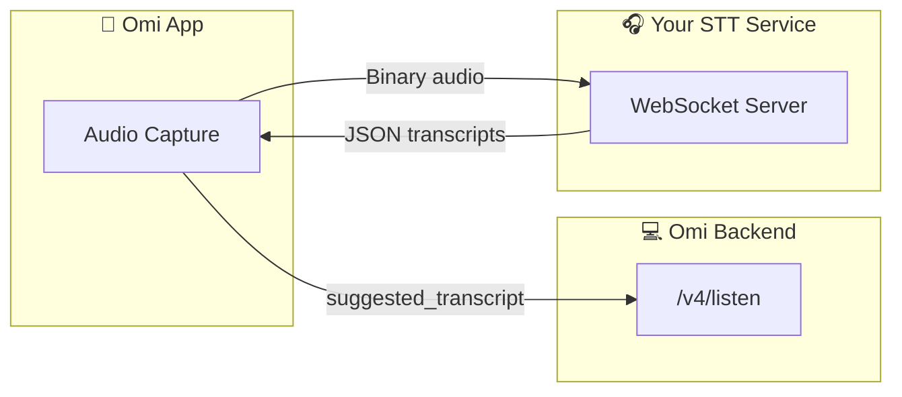

# Omi External Custom STT — TranscriptionSuite Integration

## Overview

TranscriptionSuite implements the Omi External Custom STT WebSocket protocol at `/ws/stt`.  
This document covers both the upstream protocol spec and the specifics of this server's implementation.

---

## Using the `/ws/stt` Endpoint

### Endpoint URL

```text
ws://<host>:9786/ws/stt?token=<api-token>&codec=pcm&sample_rate=16000&language=en
```

**Query parameters:**

| Parameter | Required | Default | Description |
|-----------|----------|---------|-------------|
| `token` | Yes* | — | API token from the server's token store. Bypassed on localhost in non-TLS mode. |
| `codec` | No | `pcm` | Audio codec: `pcm` (raw signed 16-bit LE) or `opus` |
| `sample_rate` | No | `16000` | Input sample rate in Hz |
| `language` | No | auto | BCP-47 language code, e.g. `en` |

*Token check is skipped for loopback connections when TLS is disabled.

### Protocol Flow

1. Client → Server: binary audio frames (PCM or Opus depending on `codec`)
2. Client → Server: `{"type": "CloseStream"}` (signals end of audio)
3. Server → Client: JSON segments payload (see response format below)
4. Connection closes

The server buffers all audio, transcribes the full recording on `CloseStream`, and
returns a **single** segments message.

### Diarization Behaviour

Diarization runs automatically when `HF_TOKEN` is configured:

1. **WhisperX backend** — uses native integrated diarization (`transcribe_with_diarization`).
2. **All other backends (including MLX/Metal)** — falls back to pyannote via the same
   parallel-diarize pipeline as the HTTP `/api/transcribe/file` endpoint.
3. If no HF token is available, `speaker` fields are omitted from segments.

### Configuration

```yaml
omi_stt:
  enabled: true
  inactivity_timeout_s: 90   # Close connection after 90 s of no audio frames
```

Set `enabled: false` to disable the endpoint entirely.

### Opus Codec Dependency

Omi devices send Opus audio by default. To support Opus, install the system library and
the Python extra:

```bash
brew install opus
cd server/backend && uv sync --extra omi
```

PCM mode (`codec=pcm`) has no extra dependencies.

### Getting an API Token

With the server running, read the token store:

```bash
python3 -c "
import json, pathlib
tokens = json.loads(pathlib.Path.home().joinpath(
    'Library/Application Support/TranscriptionSuite/data/tokens/tokens.json'
).read_text())
for t in tokens['tokens']:
    if t.get('is_admin') and not t.get('is_revoked'):
        print(t['token'][:8], '...', t['token'][-6:])
        break
"
```

---

## Testing with the Provided Script

`scripts/test_omi_websocket.py` handles token lookup, audio loading, PCM encoding,
chunked streaming, and saves results to `samples/output/`.

```bash
# Process all WAV/FLAC files in samples/input/ (auto-detects token)
server/backend/.venv/bin/python scripts/test_omi_websocket.py

# Process a specific file
server/backend/.venv/bin/python scripts/test_omi_websocket.py samples/input/1min_test.wav

# Remote server
server/backend/.venv/bin/python scripts/test_omi_websocket.py \
  --server ws://10.0.1.90:9786 --language en
```

**Options:**

| Flag | Default | Description |
|------|---------|-------------|
| `--server` | `ws://localhost:9786` | WebSocket server base URL |
| `--language` | auto | BCP-47 language code |

Output JSON is saved to `samples/output/<stem>_<timestamp>.json` and contains
the full server response plus metadata.

---

## Omi Protocol Spec

### External Custom STT Service

Build your own transcription/diarization WebSocket service that integrates with Omi.



### Your Service Receives

| Message | Format | Description |
| --- | --- | --- |
| Audio frames | Binary | Raw audio bytes (codec configured by app, typically `opus` 16kHz) |
| `{"type": "CloseStream"}` | JSON | End of audio stream |

### Your Service Sends

**Format:** JSON object with `segments` array

```json
{
  "segments": [
    {
      "text": "Hello, how are you?",
      "speaker": "SPEAKER_00",
      "start": 0.0,
      "end": 1.5
    },
    {
      "text": "I'm doing great, thanks!",
      "speaker": "SPEAKER_01",
      "start": 1.6,
      "end": 3.2
    }
  ]
}
```

### Segment Fields

| Field | Type | Required | Description |
| --- | --- | --- | --- |
| `text` | `string` | Yes | Transcribed text |
| `speaker` | `string` | No | Speaker label (`SPEAKER_00`, `SPEAKER_01`, etc.) |
| `start` | `float` | No | Start time in seconds |
| `end` | `float` | No | End time in seconds |

### Requirements

- Response **must be an object** with `segments` key. Raw arrays `[{...}]` will fail.
- Do **not** include a `type` field, or set it to `"Results"`. Other values are ignored.
- Connection closes after **90 seconds** of inactivity.
