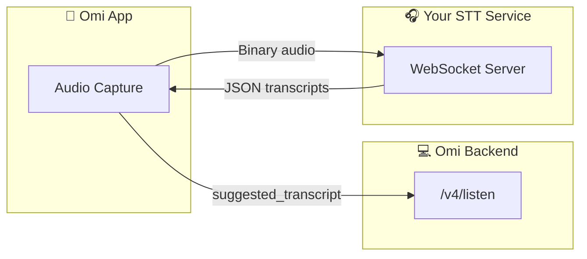

## External Custom STT Service

Build your own transcription/diarization WebSocket service that integrates with Omi.



### Your Service Receives

| Message | Format | Description |
| --- | --- | --- |
| Audio frames | Binary | Raw audio bytes (codec configured by app, typically `opus` 16kHz) |
| `{"type": "CloseStream"}` | JSON | End of audio stream |

### Your Service Sends

**Format:** JSON object with `segments` array

```json
{
  "segments": [
    {
      "text": "Hello, how are you?",
      "speaker": "SPEAKER_00",
      "start": 0.0,
      "end": 1.5
    },
    {
      "text": "I'm doing great, thanks!",
      "speaker": "SPEAKER_01",
      "start": 1.6,
      "end": 3.2
    }
  ]
}
```

### Segment Fields

| Field | Type | Required | Description |
| --- | --- | --- | --- |
| `text` | `string` | Yes | Transcribed text |
| `speaker` | `string` | No | Speaker label (`SPEAKER_00`, `SPEAKER_01`, etc.) |
| `start` | `float` | No | Start time in seconds |
| `end` | `float` | No | End time in seconds |

### Requirements

- Response **must be an object** with `segments` key. Raw arrays `[{...}]` will fail.
- Do **not** include a `type` field, or set it to `"Results"`. Other values are ignored.
- Connection closes after **90 seconds** of inactivity.
